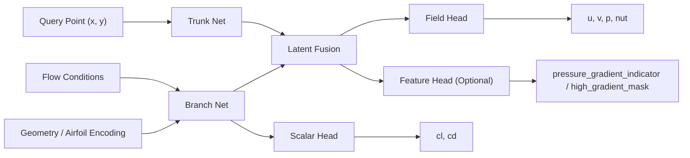

# AirfRANS 分析增强阶段汇报稿

## 1. 项目定位

本项目面向飞行器 CFD 代理建模，目标不是替代工业级求解器，而是在保留基本物理意义和工程可解释性的前提下，把一次昂贵的 CFD 求解近似为一次快速神经网络推理。

当前阶段的重点不是做“大而全”的三维全场系统，而是先在 AirfRANS 可支持的数据条件下，把二维翼型代理从“只给基础数值”推进到“能够输出分析结果”的阶段。

当前主线能力：

- 输入：几何表示、工况、查询点
- 输出：局部场、升阻力、表面压力、表面 `Cp`、slice 剖面、高梯度分析结果
- 数据：AirfRANS 2D 不可压缩 RANS 数据
- 模型主线：DeepONet 风格 operator surrogate

## 2. 为什么选 AirfRANS

AirfRANS 的特点决定了当前系统的设计边界：

- 二维翼型
- 不可压缩 RANS
- 亚声速
- 可获得的主字段是 velocity / pressure / turbulent viscosity
- 可由数据中的 force coefficient 逻辑得到 `cl / cd`

这意味着本阶段可以真实监督的重点应该是：

- `u`
- `v`
- `p`
- `nut`
- `cl`
- `cd`
- `pressure_surface`

而不应该把下面这些量伪装成真实主监督：

- `rho`
- `heat_flux_surface`
- `shock_indicator`
- `shock_location`
- 工业级 `wall_shear_surface`

## 3. 核心原理

### 3.1 本质上在学什么

这个系统学习的是一个算子映射：

`geometry + flow conditions + spatial query -> flow response`

也就是：

- 给定一个翼型几何
- 给定一个来流工况
- 给定任意一个空间位置
- 模型直接预测这个位置对应的流场变量

因此它不是传统意义上的“固定网格回归器”，而是一个可在任意查询点上取值的连续场近似器。

### 3.2 为什么这种形式适合当前任务

AirfRANS 和真实工程数据经常是：

- 点云式
- 非结构网格
- 每个样本的网格不完全一致

如果强行做成固定图像网格，容易损失几何和采样灵活性。  
DeepONet 这类 branch-trunk 结构更适合：

- 将“样本级条件”与“空间位置”分开建模
- 支持不同查询点数量
- 支持同一个样本上做 surface/slice/volume 等不同位置的统一推理

## 4. 模型结构

### 4.1 总体结构

### 4.2 各部分含义

`Branch Net`

- 负责编码“这个样本本身是什么”
- 输入是几何与工况
- 输出一个样本级 latent representation

`Trunk Net`

- 负责编码“我要在哪个空间位置查询”
- 输入是查询点坐标 `(x, y)`
- 输出一个位置级 latent representation

`Latent Fusion`

- 将 branch latent 和 trunk latent 结合
- 得到该样本在该位置上的局部响应表示

`Field Head`

- 输出点场变量
- 当前主任务是 `u / v / p / nut`

`Scalar Head`

- 输出全局气动量
- 当前主任务是 `cl / cd`

`Feature Head`

- 可选输出 analysis-oriented 特征
- 当前用于 `pressure_gradient_indicator / high_gradient_mask`

### 4.3 为什么是“共享 backbone + 多任务输出”

因为这些输出之间存在强相关性：

- 表面压力来自局部场
- `Cp` 来自表面压力
- slice 是从场上取剖面
- 高梯度区域来自场变量空间变化
- `cl / cd` 与表面压力分布高度相关

所以用共享表示学习，再通过不同 head 解码，能够：

- 保持主线简单
- 避免重复建模
- 方便后续扩展更多输出头

## 5. 输入和输出分别代表什么

### 5.1 输入

#### 1. Geometry / Geometry Params

表示翼型几何。

当前工程里可能来自：

- 参数化翼型参数
- 表面点展开后的几何编码

它回答的问题是：

- 这是一个什么形状的翼型

#### 2. Flow Conditions

表示流动工况。

当前主要包括：

- `mach`
- `aoa`
- 可选 `reynolds`

它回答的问题是：

- 这个翼型是在什么来流条件下工作

#### 3. Query Points

表示希望取值的位置 `(x, y)`。

它回答的问题是：

- 我想知道这个位置处的流场是多少

#### 4. Surface Points

表示翼型表面上的采样点。

它用于：

- 评估表面压力
- 生成 `Cp`
- 导出表面分析曲线

#### 5. Slice Definitions

表示希望抽取的剖面线。

当前支持：

- `x = const`
- `y = const`
- 任意线段

它用于：

- 观察尾迹
- 观察局部恢复区
- 比较不同位置上的剖面变化

### 5.2 输出

#### 1. Pointwise Fields

- `u`
  - `x` 方向速度分量
- `v`
  - `y` 方向速度分量
- `p`
  - 压力
- `nut`
  - 湍流运动粘性系数

这些量描述的是局部流场状态。

#### 2. Scalar Outputs

- `cl`
  - 升力系数
- `cd`
  - 阻力系数

它们描述的是整体气动性能。

#### 3. Surface Outputs

- `pressure_surface`
  - 表面压力分布
- `cp_surface`
  - 压力系数分布，定义为 `Cp = (p - p_ref) / q_ref`
- optional `velocity_surface`
  - 表面速度
- optional `nut_surface`
  - 表面湍流粘性

其中：

- `pressure_surface` 在 AirfRANS 条件下可以作为真实目标
- `cp_surface` 是由 `pressure_surface` 派生的 derived output

#### 4. Slice Outputs

是在给定剖面线上抽取的：

- `u`
- `v`
- `p`
- `nut`

它的意义是把二维场变成“可读的剖面曲线”。

#### 5. Feature / Analysis Outputs

- `pressure_gradient_indicator`
- `high_gradient_mask`
- `high_gradient_region_summary`

这些量不是基础物理量，而是为了分析服务：

- 帮助快速找到高梯度区域
- 帮助做报告可视化
- 帮助辅助判断尾迹、强压差变化带等结构

## 6. 训练与监督设计

### 6.1 当前真实监督项

AirfRANS 主路径下，当前真正参与训练或可真实监督的核心是：

- point field loss：`u / v / p / nut`
- scalar loss：`cl / cd`
- surface loss：`cp_surface`
- slice loss：slice field
- feature loss：高梯度伪标签

### 6.2 为什么没有把所有东西都放进 loss

因为不是所有输出都具备同等可信度：

- `pressure_surface`
  - 在数据上真实存在，但 raw pressure 尺度大，直接监督会压制其他任务
- `cp_surface`
  - 更稳定，且物理上更接近工程分析习惯
- `heat_flux_surface`
  - 目前只是占位 proxy
- `wall_shear_surface`
  - 当前只是 derived 近似
- `shock_*`
  - 在 AirfRANS 条件下不能视为真实 ground truth

因此训练策略必须遵守一个原则：

- 能真实监督的量就真实训练
- 只能近似导出的量就明确标记 derived / placeholder

## 7. 后处理与分析模块原理

模型不是直接输出所有分析量，很多结果来自后处理。

### 7.1 `cp_surface`

由表面压力计算：

`Cp = (p - p_ref) / q_ref`

其中：

- `p_ref` 是参考静压
- `q_ref` 是参考动压

意义：

- 更利于不同工况之间比较
- 更符合气动分析习惯

### 7.2 Slice Extraction

从点场中沿给定线段采样/插值，得到剖面曲线。

意义：

- 把二维场转换为汇报中更易理解的 1D 曲线

### 7.3 Gradient Indicators

基于压力或场变量的空间梯度构造：

- 梯度幅值
- 高梯度 mask
- 高梯度区域摘要

意义：

- 不替代真实 shock label
- 但对分析尾迹、压力急剧变化带很有价值

## 8. 当前结果说明

在最新一次重训练中，系统已经可以稳定给出：

- `u / v / p / nut`
- `cl / cd`
- `pressure_surface`
- `cp_surface`
- slice fields
- high-gradient analysis

这说明系统已经从“基础代理”进入“可分析代理”的阶段。

但也要明确：

- `pressure_surface` 的 raw RMSE 仍较大
- `cp_surface` 已可用，但仍有优化空间
- 高梯度结果属于分析代理，不应包装成真实 shock benchmark

## 9. 后续优化工作

后续优化可以分成四条线。

### 9.1 模型层优化

- 提升 branch 几何编码能力
- 引入更强的 trunk 表达
- 尝试更稳定的多任务 head 解耦
- 研究 attention / transformer 风格 operator backbone

### 9.2 数据层优化

- 更精细的 surface sampling
- 更稳定的 slice 定义与评测协议
- 更好的 pressure reference 归一化
- 对 `nut` 做更合理的尺度处理

### 9.3 损失设计优化

- 对不同任务做自适应 loss weighting
- 引入针对 surface / scalar 的 curriculum training
- 研究对 `Cp`、`Cl/Cd` 更直接的约束
- 用更合理的 derived-label 置信机制训练 feature head

### 9.4 工程层优化

- 更规范的实验管理
- 自动保存最优图表与对比报告
- 更丰富的评测切片
- 面向汇报和交付的自动化结果汇总

## 10. 如何从 2D 推广到 3D

二维到三维不能简单理解为“把输入坐标从 `(x, y)` 改成 `(x, y, z)`”。

真正的推广需要在以下几个层面一起变化。

### 10.1 输入表示的变化

2D 中几何通常还是：

- 参数
- 表面线
- 小规模点集

3D 中几何会变成：

- 机翼/机身/舵面/发动机短舱等复杂曲面
- 多部件组合
- 拓扑更复杂

所以 3D 需要更强的几何表示方式，例如：

- 表面网格编码
- 点云编码
- signed distance / occupancy 场
- CAD 参数或 CST/B-spline 参数化

### 10.2 查询空间的变化

2D 是在平面上查询：

- `(x, y)`

3D 则是在体空间上查询：

- `(x, y, z)`

这会带来：

- 查询点数量暴涨
- 内存和训练时间显著增加
- 采样策略变得更关键

### 10.3 输出维度的变化

2D 输出通常是：

- `u, v, p, nut`

3D 至少会变成：

- `u, v, w, p, nut`

如果进一步走向工业级，还会涉及：

- 密度
- 温度
- 能量
- 多种湍流变量
- 更复杂的表面载荷与壁面量

### 10.4 模型结构的变化

2D 下 DeepONet 还能作为轻量起点。  
3D 时通常需要考虑：

- 更强的几何编码器
- 面向点云/表面网格的 GNN
- 体网格或稀疏体素结构
- 适配三维场的 FNO / GeoFNO / Transformer Operator

换句话说：

- 2D 可以先靠“坐标条件查询”
- 3D 更可能需要“几何感知 + 空间结构感知”的更强 backbone

## 11. 从 2D 到 3D 面临的主要困难

### 11.1 数据成本暴涨

3D CFD 数据的生成成本远高于 2D：

- 网格构建更复杂
- 单算例计算时间更长
- 存储更大
- 数据清洗更难

这会直接限制：

- 样本规模
- 参数覆盖度
- 工况丰富度

### 11.2 几何复杂度急剧上升

2D 翼型是一条封闭曲线。  
3D 飞行器几何是复杂曲面和多部件系统。

困难包括：

- 几何拓扑不统一
- 多部件边界条件耦合
- 局部细节尺度差异很大

### 11.3 物理复杂度更高

3D 实际工程流场更容易出现：

- 三维分离
- 涡结构
- 横向耦合流动
- 更复杂的边界层行为

如果进一步面向跨声速/高超声速，还会出现：

- 激波
- 热流
- 可压缩效应
- 强非线性壁面现象

### 11.4 计算与内存压力

3D 训练最容易卡在：

- GPU 内存
- I/O 吞吐
- 推理采样效率

如果仍采用“点查询”方式，三维体场采样的点数会远多于 2D，训练代价明显上升。

### 11.5 监督协议更难定义

2D 中 surface、slice、field 的定义相对简单。  
3D 中则需要明确：

- 哪些表面区域重点监督
- 哪些剖面平面最有分析意义
- 如何统一不同几何之间的评测协议

如果这个协议不稳定，模型结果就很难比较。

## 12. 一个现实可行的 3D 推广路线

建议采用分阶段推进，而不是一步做成工业级全量系统。

### 阶段 1：2.5D / 简化 3D

先从简单三维体开始：

- 挤出翼型
- 简化机翼
- 单部件低速外流

目标：

- 验证三维查询和几何编码链路

### 阶段 2：3D 机翼级

再推进到：

- 有展向变化的机翼
- 预测 `u / v / w / p / nut`
- 输出 spanwise surface pressure 和 sectional load

目标：

- 做出真正的三维机翼代理

### 阶段 3：多部件飞行器级

再扩展到：

- 机翼 + 机身 + 尾翼
- 多工况
- 更复杂边界

目标：

- 建立工程级几何编码和多部件耦合能力

### 阶段 4：工业级高保真增强

最后才考虑：

- 更强的物理约束
- 更完整的表面量
- 更复杂的压缩性与热流现象

## 13. 汇报结论

当前这套系统已经证明：

1. 在 AirfRANS 数据条件下，二维代理主线可以稳定训练。
2. 系统已经不只是输出基础数值，而是能输出表面、slice 和高梯度分析结果。
3. 当前模型结构清晰，可维护，可继续扩展。
4. 对没有真实监督的数据量保持了边界意识，没有把 placeholder 包装成 benchmark。
5. 从 2D 推广到 3D 是可行的，但核心挑战不在“改一维坐标”，而在几何表示、数据规模、物理复杂度和监督协议的系统升级。

如果把这项工作放在整个项目路线中看，当前阶段最重要的价值是：

- 先把“能训练、能评测、能导出、能分析、能汇报”的二维工程链路做扎实
- 再以此为基础，有节奏地推进到三维
